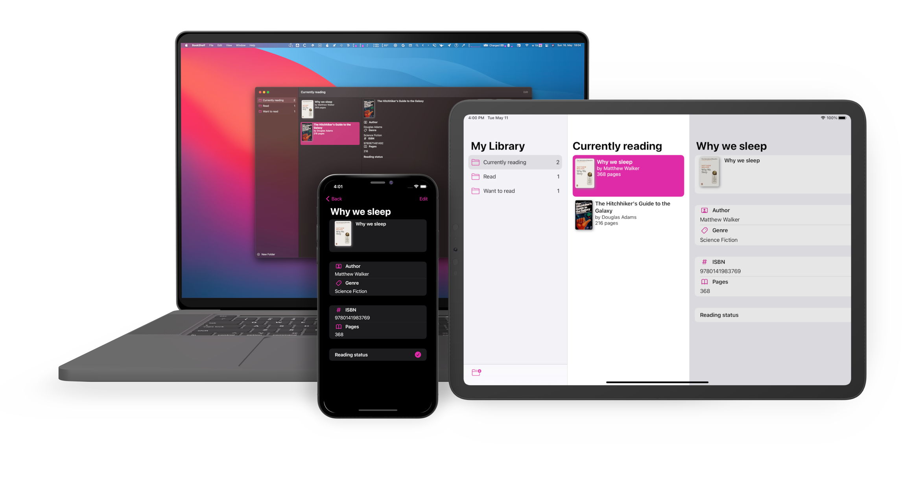

<!-- PROJECT SHIELDS -->
[![Contributors][contributors-shield]][contributors-url]
[![Forks][forks-shield]][forks-url]
[![Stargazers][stars-shield]][stars-url]
[![Issues][issues-shield]][issues-url]
[![Discussions][discussions-shield]][discussions-url]
[![Feature Requests][featurerequest-shield]][featurerequest-url]
[![License][license-shield]][license-url]
[![LinkedIn][linkedin-shield]][linkedin-url]

<!-- PROJECT LOGO -->
 

  

  <h1 align="center">BookShelf</h1>

  

    An app for cataloguing and tracking your books.
     
    <a href="https://www.youtube.com/watch?v=puo-pRlD3fA"><strong>Watch the talk »</strong></a>
     
     
    <a href="https://github.com/peterfriese/BookShelf/issues/new?assignees=&labels=&template=bug_report.md&title=">Report Bug</a>
    ·
    <a href="https://github.com/peterfriese/BookShelf/issues/new?assignees=&labels=&template=feature_request.md&title=">Request Feature</a>
  

<!-- TABLE OF CONTENTS -->

  
Table of Contents

  <ol>
    <li>
      <a href="#about-the-project">About The Project</a>
    </li>
    <li>
      <a href="#getting-started">Getting Started</a>
      <ul>
        <li><a href="#prerequisites">Prerequisites</a></li>
        <li><a href="#installation">Installation</a></li>
        <li><a href="#running">Running</a></li>
      </ul>
    </li>
    <li><a href="#contributing">Contributing</a></li>
    <li><a href="#license">License</a></li>
  </ol>

<!-- ABOUT THE PROJECT -->
## About

This repository contains the source code for BookShelf, an app for cataloguing and tracking your books. The main purpose of the code is to show how to write an entire app that runs on Apple's main platforms using SwiftUI and Firebase.

I recently spoke about how I built this app at [CocoaHeadsNL](https://cocoaheads.nl/):
* [Recording](https://www.youtube.com/watch?v=puo-pRlD3fA)
* Slides: [Speaker Deck](https://speakerdeck.com/peterfriese/firebase-for-apple-developers) / [Slideshare](https://www.slideshare.net/peterfriese/firebase-for-apple-developers)

<!-- GETTING STARTED -->
## Getting Started

### Prerequisites

To run the samples, you will need:
* Xcode 12.x

### Installation

1. Install Xcode (see https://developer.apple.com/xcode/)

<!-- CONTRIBUTING -->
## Contributing

Contributions are what make the open source community such an amazing place to be learn, inspire, and create. Any contributions you make are **greatly appreciated**.

1. Fork the Project
2. Create your Feature Branch (`git checkout -b feature/AmazingFeature`)
3. Commit your Changes (`git commit -m 'Add some AmazingFeature'`)
4. Push to the Branch (`git push origin feature/AmazingFeature`)
5. Open a Pull Request

<!-- LICENSE -->
## License

Distributed under the Apache 2 License. See `LICENSE` for more information.

<!-- MARKDOWN LINKS & IMAGES -->
<!-- https://www.markdownguide.org/basic-syntax/#reference-style-links -->
[contributors-shield]: https://img.shields.io/github/contributors/peterfriese/BookShelf.svg?style=flat-square
[contributors-url]: https://github.com/peterfriese/BookShelf/graphs/contributors
[forks-shield]: https://img.shields.io/github/forks/peterfriese/BookShelf.svg?style=flat-square
[forks-url]: https://github.com/peterfriese/BookShelf/network/members
[stars-shield]: https://img.shields.io/github/stars/peterfriese/BookShelf.svg?style=flat-square
[stars-url]: https://github.com/peterfriese/BookShelf/stargazers
[issues-shield]: https://img.shields.io/github/issues/peterfriese/BookShelf.svg?style=flat-square
[issues-url]: https://github.com/peterfriese/BookShelf/issues
[license-shield]: https://img.shields.io/github/license/peterfriese/BookShelf.svg?style=flat-square
[license-url]: https://github.com/peterfriese/BookShelf/blob/master/LICENSE.txt

[linkedin-shield]: https://img.shields.io/badge/-LinkedIn-black.svg?style=flat-square&logo=linkedin&colorB=555
[linkedin-url]: https://www.linkedin.com/in/peterfriese
[product-screenshot]: images/screenshot.png

[swift-shield]: https://img.shields.io/badge/swift-5.3-FA7343?logo=swift&color=FA7343&style=flat-square
[swift-url]: https://swift.org

[xcode-shield]: https://img.shields.io/badge/xcode-12.5_beta-1575F9?logo=Xcode&style=flat-square
[xcode-url]: https://developer.apple.com/xcode/

[featurerequest-url]: https://github.com/peterfriese/BookShelf/issues/new?assignees=&labels=type%3A+feature+request&template=feature_request.md
[featurerequest-shield]: https://img.shields.io/github/issues/peterfriese/BookShelf/feature-request?logo=github&style=flat-square
[discussions-url]: https://github.com/peterfriese/BookShelf/discussions
[discussions-shield]: https://img.shields.io/badge/discussions-brightgreen?logo=github&style=flat-square